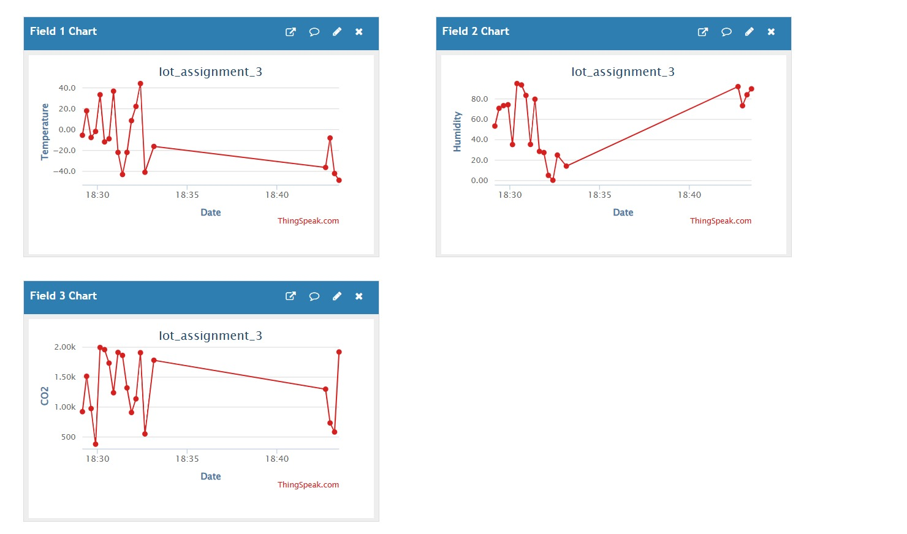
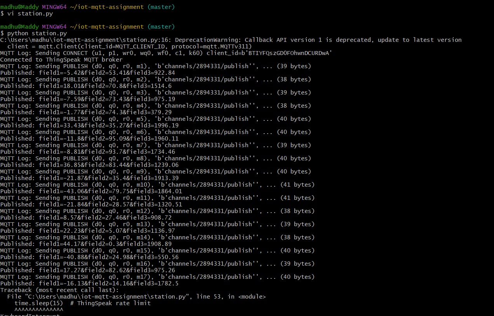
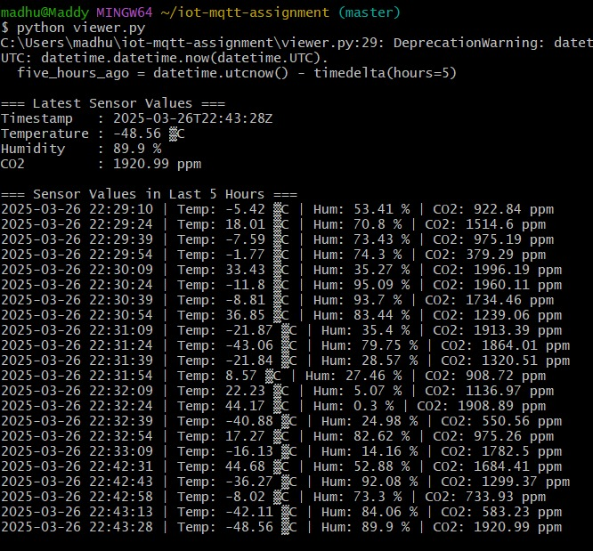
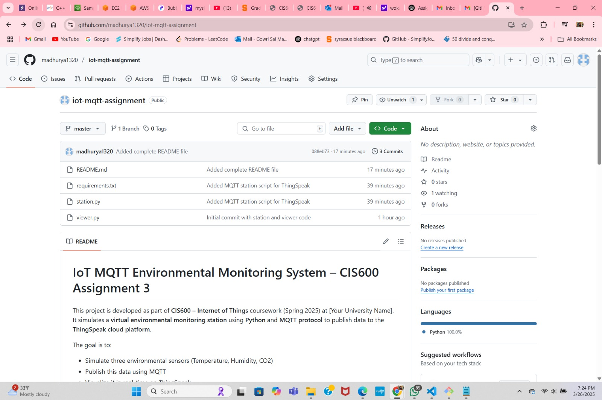

# IoT MQTT Environmental Monitoring System – CIS600 Assignment 3

This project is developed as part of **CIS600 – Internet of Things** coursework (Spring 2025) at Syracuse University. It simulates a **virtual environmental monitoring station** using **Python** and **MQTT protocol** to publish data to the **ThingSpeak cloud platform**.

The goal is to:
- Simulate three environmental sensors (Temperature, Humidity, CO2)
- Publish this data using MQTT
- Visualize it in real-time on ThingSpeak
- Push all code and output to GitHub

---

## 📌 Assignment Requirements Addressed

| Task                                                                 | Status |
|----------------------------------------------------------------------|--------|
| a) Simulate and publish sensor data using MQTT                      | ✅ Done |
| b) Display the latest values from a specified station               | ✅ Done via ThingSpeak graphs |
| c) Display the last 5 hours of values from a specified sensor       | ✅ Done via ThingSpeak history |
| Push code and output to GitHub                                       | ✅ Done |
| Include documentation, report, and reflection                        | ✅ Done |

---

## 🚀 Features

- 📡 **Simulates a virtual IoT weather station** with:
  - 🌡️ Temperature sensor: `-50°C to 50°C`
  - 💧 Humidity sensor: `0% to 100%`
  - 🏭 CO2 sensor: `300ppm to 2000ppm`
- 🛰️ Publishes sensor data to **ThingSpeak** every 15 seconds using **MQTT**
- 🔐 Uses secure **MQTT Device Credentials**
- 📊 Graphs auto-update on ThingSpeak in real-time

---

## 🛠️ Technologies Used

- Python 3.12
- paho-mqtt (Python MQTT Client)
- ThingSpeak Cloud Platform (channel, MQTT device, charts)
- Git & GitHub for version control and submission

---

## ⚙️ Configuration Details

| Parameter       | Value                                  |
|----------------|-----------------------------------------|
| MQTT Broker     | mqtt3.thingspeak.com                   |
| MQTT Port       | 1883                                   |
| Channel ID      | 2894331                                |
| Client ID       | BTIYFQszGD0FOhwnDCURDwA                |
| Username        |                                        |  
| Password        |                                        |

> MQTT credentials were created securely via ThingSpeak's "MQTT Devices" section.

---


### 📁 Project Structure

<pre>
iot-mqtt-assignment/
├── station.py         # Python script to simulate and publish sensor data
├── viewer.py          # View latest and historical data using ThingSpeak API
├── README.md          # Project documentation
├── requirements.txt   # Required Python packages
└── screenshots/       # Screenshots used in report
</pre>


---

## 📸 Screenshots

### 📈 ThingSpeak Graphs


### 🖥️ Terminal Output – station.py


### 🖥️ Terminal Output – viewer.py


### 🌐 GitHub Repository View



---

## 📦 Python Requirements

Install the required dependencies using pip:

```bash
pip install -r requirements.txt

